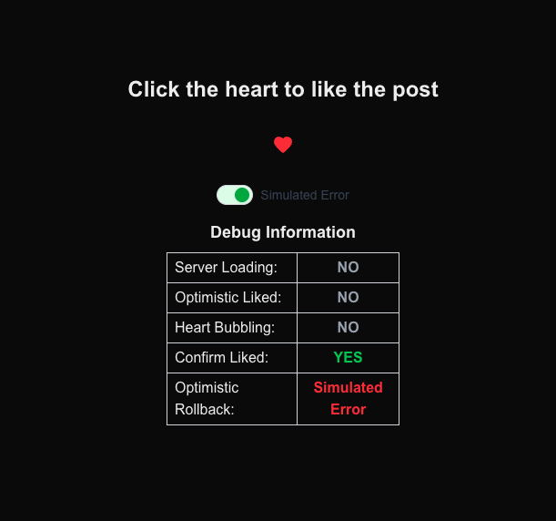

# ❤️ Optimistic UI Heart Button

A React component demonstrating optimistic updates with automatic rollback if server call fails.

## ✨ Features

- **Optimistic Updates**: Heart turns red immediately on click before server confirms
- **Animated Feedback**: Bubble animation provides delightful visual feedback
- **Automatic Rollback**: UI state reverts automatically if server action fails
- **Error Handling**: Gracefully handles and displays server errors

## ⚡️ How It Works

The `FavoriteButton` uses a custom `useOptimisticAction` hook that combines React's `useActionState` and `useOptimistic` hooks to:

1. **Update UI Immediately**: Shows the "liked" state without waiting for server response
2. **Process Server Action**: Sends the request to the server in the background (simulated using Next.js server actions)
3. **Handle Success/Failure**: Either keeps the optimistic state or rolls back on error

## 🧪 Testing Error States

Toggle "Simulated Error" mode to see the optimistic rollback in action. The debug table shows the full lifecycle:

- Server Loading: Whether the server action is in progress
- Optimistic Liked: The temporary optimistic state
- Heart Bubbling: Animation status
- Confirm Liked: The confirmed server state
- Optimistic Rollback: When the server returns an error

## 🛠️ Implementation

Built with:
- React 19
- Next.js 15 (App Router, Server Actions)
- Tailwind CSS
- Material UI Icons

This pattern demonstrates how to build responsive, resilient UIs that feel instant while maintaining data integrity.
